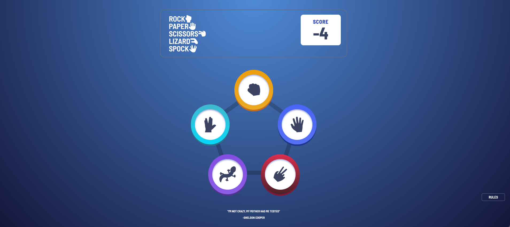
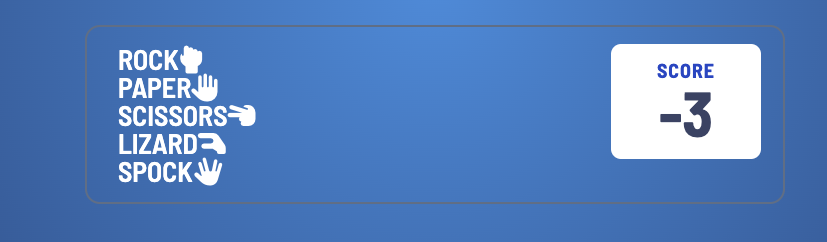
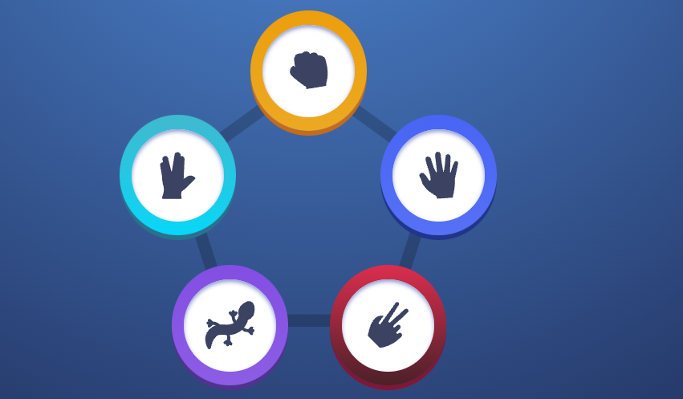
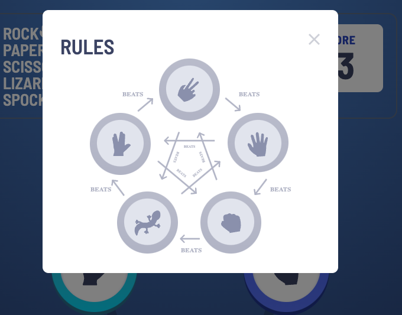

# Bazinga!

Welcome to my version of the game of Rock, Paper, Scissors, Lizard, Spock. I have given my site the name of Bazinga, a homeage to the original creator of this game Sheldon Cooper. this game is designed using my skills in HTML, CSS, and JavaScript. This is a game to help friends and family members enjoy a game with truly random results as it is statistically proven that people who  know each each other tend to tie playing with each other in the standard Rock, Paper, Scissors game. 

This project was a real challenge, as this was my first experience with Javascript I struggled to begin this project so I found a mentor website called frontendmentor.io that assigns leveled challenges that provide the ential assets and layouts for the wensite. After creating an account and downloding the zip file I began building the HTML and CSS for this project. I used YouTube resourves and GitHub repositorirs like https://github.com/Conal2023/RPSLS/tree/main and https://github.com/Antonyeaster/deathly-wise-wizards?tab=readme-ov-file#Deployment for reference in building this website. 

## Features
### Title and Scoreboard

Here we can see the new version of the ever so popular rock paper scizzors. This game consisting of 5 options, Rock, Paper, Scissors, Lizard and Spock. These titles apper beside the hand signs used to display this game in real life. Opposite this we have a scoreboard that will add 1 for every time you win and will deduct a number every time you lose, there is no change if you tie.

### Users Choice 

This section displsys 5 options each encirceled by a different color. Each option has a unique icon disolaying the choices so anyone even slightly familiar with this game can play and enjoy the gane. There is a background pentagon image showing each point as a choice of option.

### Rules

This part, once clicked, will open the game rules and how the scores are calculated. The rulles are " Scissors cuts paper, paper covers rock, rock crushes lizard, lizard poisons Spock, Spock smashes scissors, scissors decapitates lizard, lizard eats paper, paper disproves Spock, Spock vaporizes rock, and as it always has, rock crushes scissors. ".

## Testing

### Lighthouse

My websites lighthouse score.

### Validator Testing
My website passed validation checks on JSHint JavaScript Validator, W3C HTML Validator and W3C CSS Validator (Jigsaw). 

### Manual Testing

## Deployment

The site was deployed to GitHub pages. The steps to deploy are as follows:
- In the GitHub repository, navigate to the Settings tab
From the source section drop-down menu, select the Master Branch
- Once the master branch has been selected, the page will be automatically refreshed with a detailed ribbon display to indicate the successful deployment.
- The live link can be found here - https://seanbyrne5.github.io/bazzinga/

## Bugs
 I have encountered a number of bugs on this project I was mostly able to fix these bugs as i progressed though my project. 

### Unfixed Bugs

## Credits
I got the color pallets, images and icons from a website https://www.frontendmentor.io they offer coding challenges and points on completed submissions. When I chose the Rock, Paper, Scissors, Lizard, Spock game there was a downloadable file with all the svg images and icons as well as the colors to be used and design layout. I also used YouTube resources as a guide to build my website such as https://www.youtube.com/watch?v=P_H4_miTKsI as a base to build this game.
 I used GitHub repositorirs like https://github.com/Conal2023/RPSLS/tree/main and https://github.com/Antonyeaster/deathly-wise-wizards?tab=readme-ov-file#Deployment for reference in building this website. 