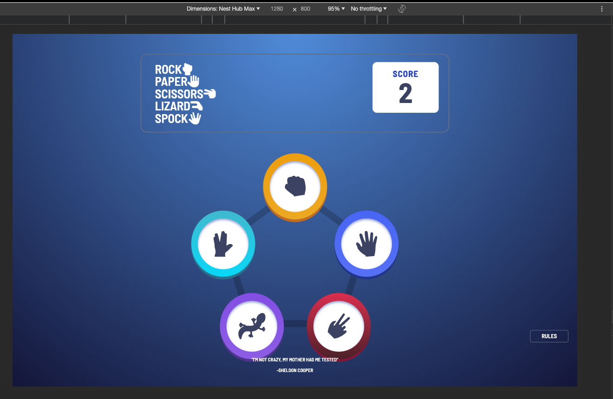

# Bazinga!

Welcome to my version of the game of Rock, Paper, Scissors, Lizard, Spock. I have given my site the name of Bazinga, an homage to the original creator of this game, Sheldon Cooper. This game is designed using my skills in HTML, CSS, and JavaScript. It aims to provide friends and family members with a game featuring truly random results. It is statistically proven that people who know each other tend to tie when playing the standard Rock, Paper, Scissors game.

This project was a real challenge, as it was my first experience with JavaScript. I struggled to begin this project, so I found a mentor website called frontendmentor.io that assigns leveled challenges, providing initial assets and layouts for the website. After creating an account and downloading the zip file, I started building the HTML and CSS for this project.

I used YouTube resources and GitHub repositories like https://github.com/Conal2023/RPSLS/tree/main and https://github.com/Antonyeaster/deathly-wise-wizards?tab=readme-ov-file#Deployment for reference while building this website.

## Features
### Title and Scoreboard

Here, we present the new version of the ever-popular rock-paper-scissors game. This game consists of five options: Rock, Paper, Scissors, Lizard, and Spock. These titles appear beside the hand signs used to represent this game in real life. Opposite this, we have a scoreboard that will add 1 for every time you win and will deduct a number every time you lose; there is no change if you tie.

### Users Choice 

This section displays five options, each encircled by a different color. Each option has a unique icon, displaying the choices, so anyone even slightly familiar with this game can play and enjoy it. There is a background pentagon image showing each point as a choice of option.

### Rules

Once clicked, this part will open the game rules and explain how the scores are calculated. The rules are as follows: "Scissors cuts paper, paper covers rock, rock crushes lizard, lizard poisons Spock, Spock smashes scissors, scissors decapitates lizard, lizard eats paper, paper disproves Spock, Spock vaporizes rock, and as it always has, rock crushes scissors."

## Testing

### Lighthouse

My websites lighthouse score.

### Validator Testing
- HTML
   - No errors were returned when passing through the official W3C validator
- CSS
   - No errors were found when passing through the official (Jigsaw) validator
- JavaScript
   - No errors were found when passing through the official Jshint validator

### Manual Testing
I have completed testing of my website by sharing it with friends and family members to test on their personal devices, and all have reported it as fully functional without any issues. Additionally, I conducted testing using Chrome Dev Tools to assess responsiveness on various screen sizes.

- iPhone 12 Pro

  

- Pixel 7

   

- iPad Air

  

- Surface Duo

- Nest Hub Max

  

- Macbook Air

   

### Responsive Testing
 
While I designed this website to be orimarily expected to be used on a computer browser window, I have made it responsive for phone and tablet size screens also.

## Deployment

The site was deployed to GitHub pages. The steps to deploy are as follows:
- In the GitHub repository, navigate to the Settings tab
From the source section drop-down menu, select the Master Branch
- Once the master branch has been selected, the page will be automatically refreshed with a detailed ribbon display to indicate the successful deployment.
- The live link can be found here - https://seanbyrne5.github.io/bazzinga/

## Bugs
 I encountered several bugs during this project, and for the most part, I was able to fix them as I progressed. However, I faced a particular challenge with one bug – loading images into the modal I had created. Although I had learned to create a modal, upon deployment, it resulted in a console error, and the images would not load in the modal.
  - Example

 

 Since this was my first experience with a modal, I accidentally created an absolute file path within the modal, which prevented the images from loading. Once I fixed this issue, the modal worked as I had expected it to.

### Unfixed Bugs

## Credits
I obtained the color palettes, images, and icons from the website https://www.frontendmentor.io, which offers coding challenges and awards points for completed submissions. When I selected the Rock, Paper, Scissors, Lizard, Spock game challenge, there was a downloadable file with all the SVG images and icons, as well as the specified colors and design layout.

To build my website, I utilized YouTube resources as a guide, with https://www.youtube.com/watch?v=P_H4_miTKsI serving as a base for creating this game. Additionally, I referred to GitHub repositories like https://github.com/Conal2023/RPSLS/tree/main and https://github.com/Antonyeaster/deathly-wise-wizards?tab=readme-ov-file#Deployment for further guidance during the development of this website.